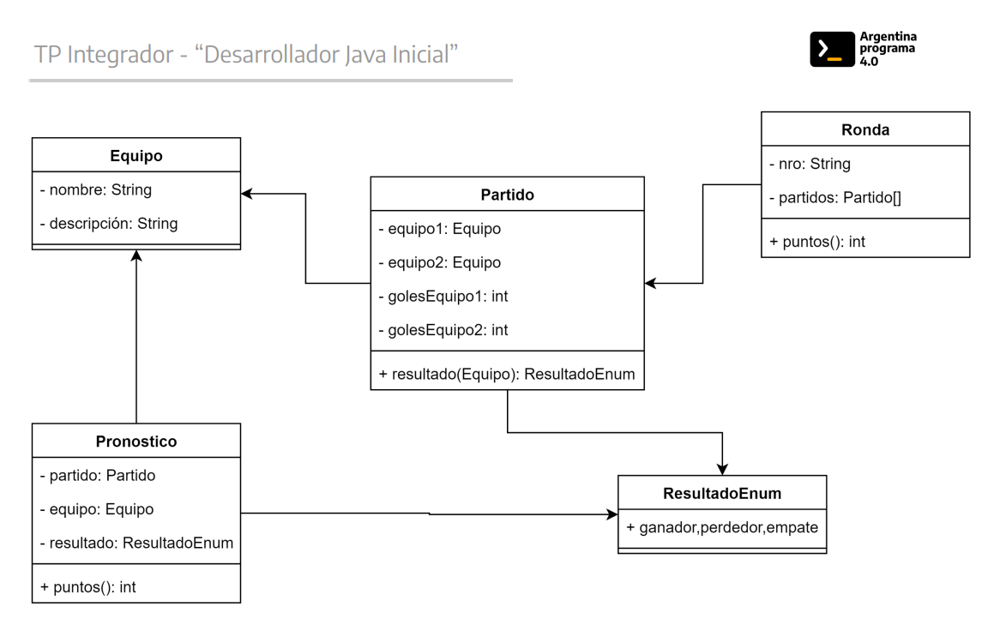
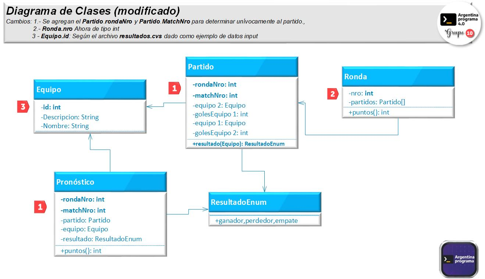

# __Pronósticos Deportivos__  -  ___Grupo 10/150___
##  ___Entrega 1___ (con openCsv y Lombok) 
## __Datos de la Presentación__

#### Fecha Primer Entrega: ` semana del 4 de abril del 2023 (clase 12)`
>##### Integrantes por orden alfabético:
>* __`Guillermo Escobar`__
>* __`Norma Ramirez`__
>* __`Pablo Martin Torres`__
>* __`Juan Carlos Alderete`__

## **Comandos simples para ejecutar con maven**

### Crear archivo jar para maven:
```
mvn install
```

### Ejecutar desde root el proyecto maven:
```
mvn exec:java -Dexec.mainClass=com.grupo10_150.App
```

### Estructura del proyecto:
```
.
├── README.md
├── pom.xml
└── src
    └── main
        └── java
            ├── grupo10_150
            │   ├── Persona.java
            │   ├── Partido.java
            │   ├── Resultado.java
            │   ├── Ronda.java
            │   └── App.java
            └── resources
                └── pronostico.csv
                └── resultados.csv

   
```

------

## Introducción
Nos han solicitado el desarrollo de un programa de Pronósticos Deportivos.
Un pronóstico deportivo consta de un posible resultado de un partido (que un equipo gane,
pierda o empate), propuesto por una persona que está participando de una competencia
contra otras.
Cada partido tendrá un resultado. Este resultado se utilizará para otorgar puntos a los
participantes de la competencia según el acierto de sus pronósticos.
Finalmente, quien gane la competencia será aquella persona que sume mayor cantidad de
puntos.
<br>
## Consigna
La propuesta del trabajo práctico consiste en implementar un programa de consola que dada
la información de resultados de partidos e información de pronósticos, ordene por puntaje
obtenido a los participantes.
<br>
## Alcance
En este trabajo práctico nos limitaremos a pronosticar los resultados de los partidos, sin
importar los goles ni la estructura del torneo (si es grupo, eliminatoria u otro); simplemente se
sumarán puntos y se obtendrá un listado final.
A continuación, se propone un diagrama de clases inicial que puede ser modificado en
cualquier momento
<br> <br>

# **Diagrama de Clases** 
<p align="center">
  
</p>


>__ENTREGA 1:__ A partir del esquema original propuesto, desarrollar un programa que lea un archivo de
partidos y otro de resultados, el primero correspondiente a una ronda y el otro que contenga
los pronósticos de una persona1. Cada ronda debe tener una cantidad fija de partidos.
<br> 

__Se considera una única ronda y un único participante en esta entrega__
<br><br>

# __Diagrama de Clases Aumentado__ 
<p align="center">
  
</p>


